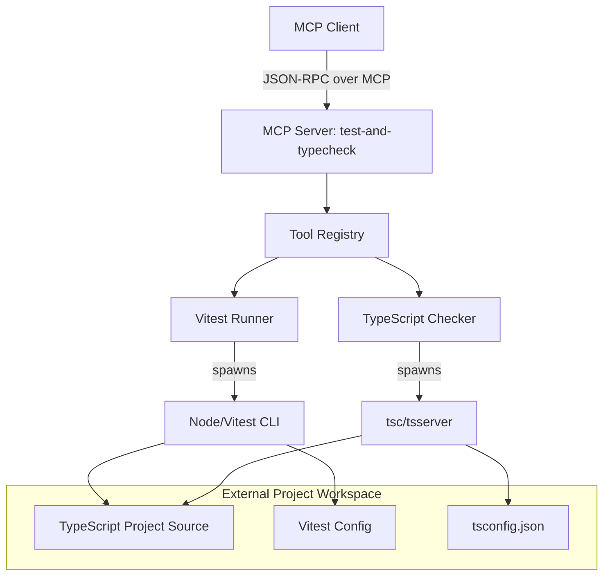
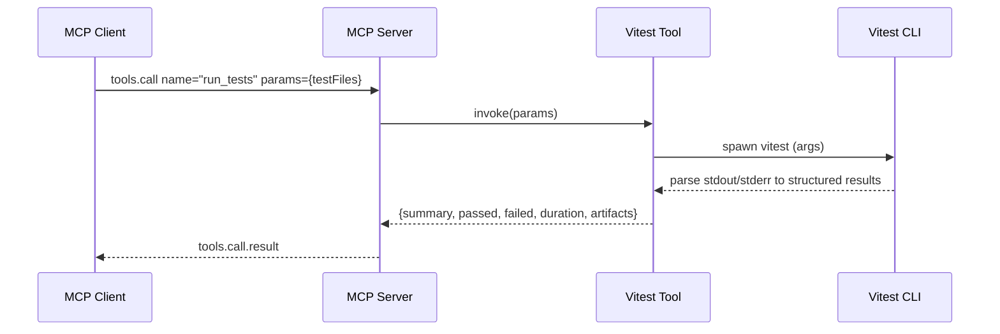
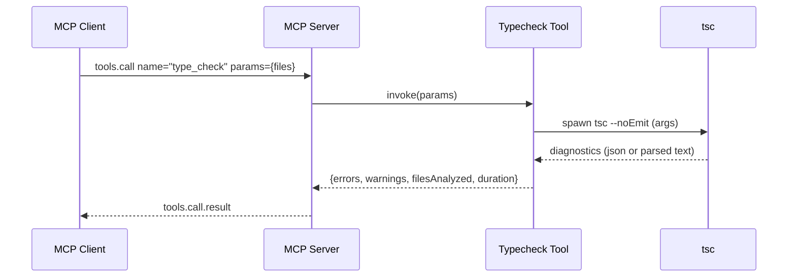
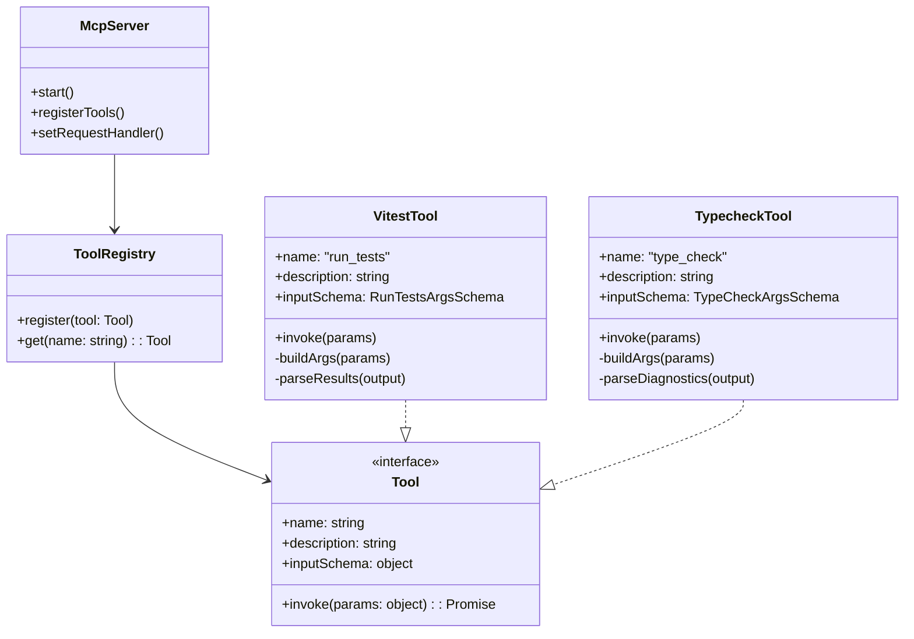

# Test & Typecheck MCP Server

An MCP Server that exposes tools for running tests (Vitest) and performing TypeScript type-checks against a project, enabling LLM/MCP clients to invoke reliable verification cycles on demand.

## Table of Contents
- [Overview](#overview)
- [Features](#features)
- [Architecture Overview](#architecture-overview)
- [Sequence Diagrams](#sequence-diagrams)
- [Class Diagram](#class-diagram)
- [Installation](#installation)
- [Configuration](#configuration)
- [Usage](#usage)
- [Usage Scenarios (Personas)](#usage-scenarios-personas)
- [Testing & Dev Workflow](#testing--dev-workflow)
- [Security & PII](#security--pii)
- [Troubleshooting](#troubleshooting)
- [Roadmap](#roadmap)
- [License](#license)

## Overview
This server implements the Model Context Protocol (MCP) to provide:
- Test execution using Vitest
- Static type analysis using TypeScript

It is intended to be used by developer tools, QA assistants, and CI-style automations where on-demand, reproducible checks are needed.

## Features
- Trigger test runs (full or filtered) with rich summaries
- Run TypeScript type-check across a project
- Structured tool responses suitable for automated reasoning
- Configurable project root and per-run options

## Architecture Overview


## Sequence Diagrams

### Test Run (Vitest)


### Typecheck (TypeScript)


## Class Diagram


## Installation
- Node.js >= 18 recommended
- npm or pnpm

```bash
npm install
# or
pnpm install
```

### Running the Server

**Local Development:**
```bash
npm run build
node build/index.js <project-directory>
```

**Global CLI (if published):**
```bash
npm install -g mcp-server-vitest
mcp-server-vitest <project-directory>
```

## Configuration
The server requires a project directory as a command line argument:

```bash
mcp-server-vitest <project-directory>
```

Environment variables / config options:
- PROJECT_ROOT: Specified via command line argument
- The server will use the project's existing vitest and TypeScript configurations

## Usage
Integrate with your MCP-compatible client. Available tools:

### run_tests
- **Description**: Run Vitest tests for the project. Can run specific test files or all tests.
- **Parameters**: 
  - `testFiles` (optional): string or array of strings - Optional test file or array of test files to run
- **Returns**: Formatted test results with pass/fail status, duration, and details

### type_check  
- **Description**: Run TypeScript type checking on the project. Returns any type errors found.
- **Parameters**:
  - `files` (optional): string or array of strings - Optional file or array of files to type check
- **Returns**: Formatted type errors, warnings, and diagnostic information

Example tool call (JSON-RPC shape illustrative; adapt to your MCP client):
```json
{
  "method": "tools/call",
  "params": {
    "name": "run_tests",
    "arguments": { "testFiles": ["src/components/*.test.ts"] }
  }
}
```

## Usage Scenarios (Personas)

### Persona 1: SDET/QA Engineer
**Goal**: Gate a PR with fast feedback on impacted tests and coverage.

**Flow**:
1. Call `type_check` for quick static validation
2. Call `run_tests` with a pattern matching changed paths
3. Parse results and annotate PR with failing specs and coverage deltas

**Example workflow**:
```bash
# Type check first for quick feedback
mcp-client call type_check '{"files": ["src/user-service/*.ts"]}'

# Run focused tests on changed components
mcp-client call run_tests '{"testFiles": ["src/user-service/*.test.ts", "src/auth/*.test.ts"]}'
```

### Persona 2: Developer  
**Goal**: Validate a refactor locally before pushing.

**Flow**:
1. Call `type_check` to catch static errors
2. Call `run_tests` without pattern to run the full suite
3. If failures, iterate; otherwise push with confidence

**Example workflow**:
```bash
# Check all types are valid after refactor
mcp-client call type_check '{}'

# Run full test suite to ensure no regressions  
mcp-client call run_tests '{}'
```

## Testing & Dev Workflow
- **Local test of a sample TS project**:
  1. Ensure the sample project has vitest and types defined
  2. Run `type_check` with projectPath pointing to the project root
  3. Run `run_tests` with or without a pattern

- **Recommended**:
  - Keep vitest config minimal and deterministic for CI
  - Avoid flaky tests to keep tool responses stable

## Security & PII
- No external network calls beyond spawning local CLIs
- Tool outputs may include file paths and code excerpts; avoid embedding secrets in source or test output
- Consider redacting or truncating large outputs

## Troubleshooting
- **Vitest not found**: Ensure vitest is installed in the project or available in PATH
- **TypeScript not found**: Ensure typescript is installed in the project dependencies
- **Non-zero exit code**: Inspect stderr captured in tool response
- **Permission errors**: Ensure the MCP server has read access to the project directory

## Roadmap
- Streaming partial results for long-running test suites
- Rich diagnostics format with code frames
- Caching typecheck artifacts for faster subsequent runs
- Support for additional test frameworks beyond Vitest
- Watch mode support for continuous feedback

## License
MIT