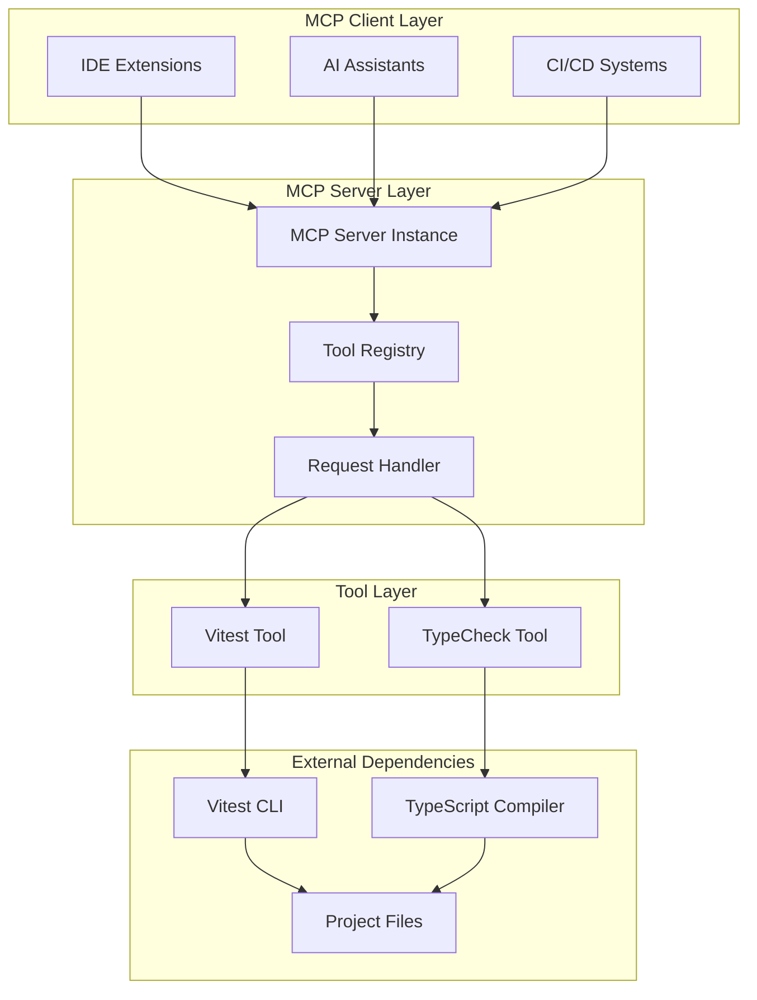
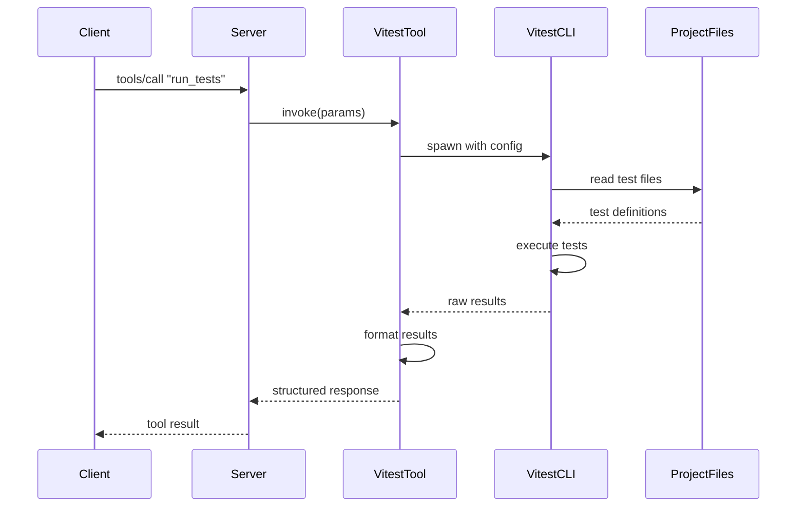
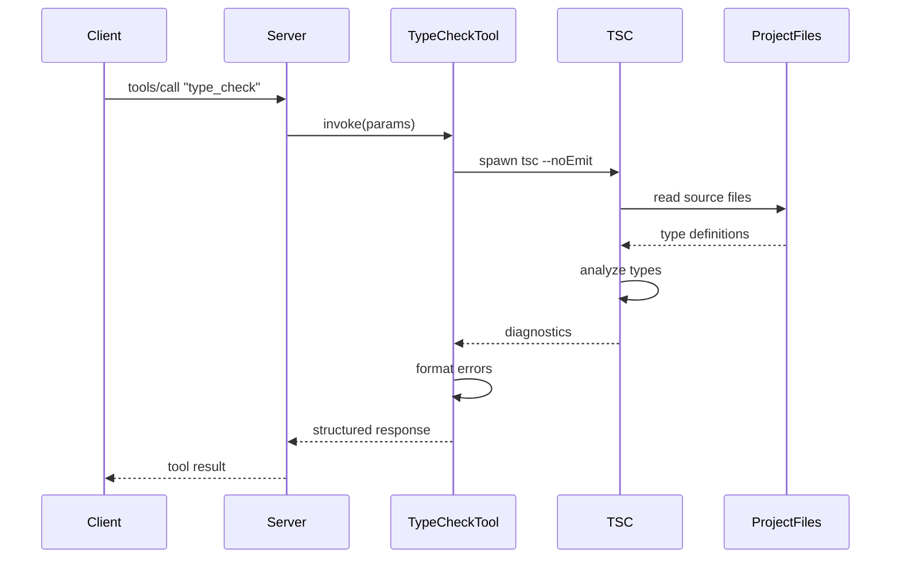

# Architecture Documentation

## Overview
The Test & Typecheck MCP Server is built following the Model Context Protocol (MCP) specification, providing tools for test execution and type checking to MCP-compatible clients.

## System Architecture

### High-Level Components



### Component Details

#### MCP Server Core
- **Purpose**: Manages the MCP protocol communication and tool orchestration
- **Key Files**: `src/index.ts`
- **Responsibilities**:
  - Handle JSON-RPC over stdio transport
  - Register and manage tools
  - Route tool calls to appropriate handlers
  - Manage project directory context

#### Tool Registry
- **Purpose**: Central registry for available tools
- **Implementation**: Built into the main server instance
- **Tools Registered**:
  - `run_tests`: Vitest execution tool
  - `type_check`: TypeScript type checking tool

#### Vitest Tool
- **Purpose**: Execute test suites using Vitest
- **Key Features**:
  - Selective test file execution
  - Structured result parsing
  - Silent execution mode to prevent console noise
- **Dependencies**: Vitest CLI, project test configuration

#### TypeCheck Tool  
- **Purpose**: Perform static type analysis using TypeScript
- **Key Features**:
  - Project-wide or selective file checking
  - Diagnostic message parsing and formatting
  - Integration with project tsconfig.json
- **Dependencies**: TypeScript compiler, project type configuration

## Data Flow

### Test Execution Flow


### Type Check Flow


## Configuration Management

### Project Context
The server operates within a specified project directory provided as a command-line argument:
```bash
mcp-server-vitest <project-directory>
```

### Tool Configuration
- **Vitest**: Uses project's vitest configuration (vitest.config.ts/js)
- **TypeScript**: Uses project's tsconfig.json
- **No external configuration required**: Tools inherit project settings

## Error Handling

### Tool-Level Error Handling
- Schema validation using Zod for input parameters
- Graceful handling of CLI spawn failures
- Structured error responses with descriptive messages

### Server-Level Error Handling
- Try-catch blocks around all tool invocations
- Proper error serialization for MCP protocol
- Fatal error handling with process exit

## Performance Considerations

### Resource Management
- Vitest instances are properly closed after execution
- No persistent processes maintained
- Memory cleanup after tool execution

### Optimization Strategies
- Silent mode execution to reduce I/O overhead
- Focused test runs when specific files provided
- Incremental type checking when file subset specified

## Security Model

### Sandboxing
- Execution limited to specified project directory
- No arbitrary command execution
- Only configured tools (vitest, tsc) spawned

### Input Validation
- All tool parameters validated against schemas
- File path validation to prevent directory traversal
- Error message sanitization to prevent information leakage

## Extensibility

### Adding New Tools
1. Define parameter schema using Zod
2. Implement tool handler function
3. Register tool in server setup
4. Add tool to documentation

### Protocol Compatibility
- Built on standard MCP SDK
- Compatible with any MCP-compliant client
- JSON-RPC transport agnostic (currently stdio)

## Deployment Considerations

### Runtime Requirements
- Node.js >= 18
- Project dependencies (vitest, typescript) installed
- Appropriate file system permissions

### Integration Patterns
- **IDE Integration**: Via MCP-compatible language servers
- **CI/CD Integration**: As validation step in pipelines  
- **AI Assistant Integration**: For automated code quality checks